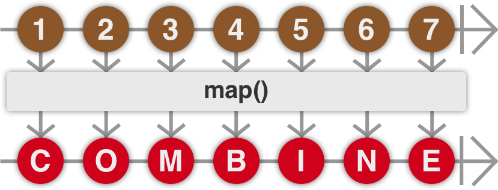
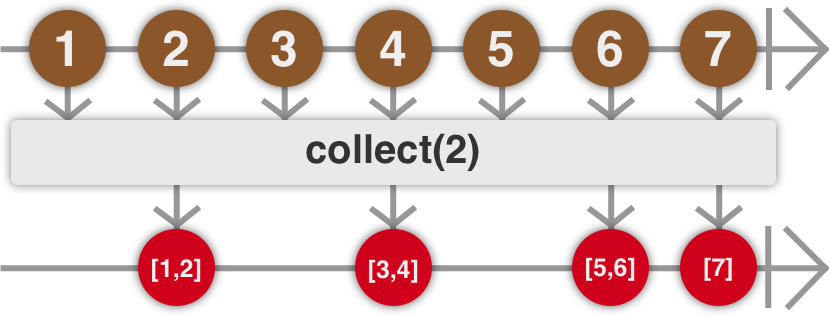

# COMBINE BASICS

## Functional Reactive Programming (FRP)

Data flows from one place to other automatically through subscriptions.

Particularly useful when data changes over time.

E.g., push slider value to stream, or use publisher to send value to subscribers, such as label showing slider value.

In addition to driving UI updates, also useful in asynchronous programming. E.g., when making network request, get result back eventually. Instead of executing completion closure, request method would return publisher, which publishes result when request done. If result needs to be transformed, or need to chain with another request, easier to read code than nested tree of completion closures.

## Publisher and Subscriber

Publisher object sends values to subscribers over time. Could be single, multiple, or no values. Can only emit single completion or error event. Publisher flow commonly represented by _marble diagram_:


Each arrow is publisher. Marble is value emitted. Top arrow has line at end representing completion event. Bottom arrow has cross representing error event. After either event, no more value.

### Code Example

Can model value stream with array.

```swift
[1, 2, 3]
    .publisher
    .sink(receiveCompletion: { completion in
        switch completion {
        case .failure(let error):
            print("Something went wrong: \(error)")
        case .finished:
            print("Received Completion")
        }
    }, receiveValue: { value in
        print("Received value \(value)")
    })
// Received value 1
// Received value 2
// Received value 3
// Received Completion
```

Combine adds `publisher` property to `Array`. Turns array of values into publisher to publish values to subscribers.

Created publisher type is `Publishers.Sequence<[Int], Never>`. `Publishers` is enum used as namespace for all publishers. Each publisher conforms to `Publisher`, but rarely created directly.

Generic types `[Int]` and `Never` mean publisher uses `[Int]` to publish values, and its failure type is `Never`, so it always completes successfully, never reaches `.failure` case in example `switch`.

Every publisher has `Output` and `Failure` associated types. `Output` is value type publisher pushes to subscribers. In example sequence publisher, `Output` is `Int`, `Failure` is `Never`. Fallible publisher often uses object conforming to `Error` as `Failure` type, but can specify another.

Subscribe to publisher with `sink(receiveCompletion:receiveValue:)`. Also special version if publisher cannot fail, only need to supply `receiveValue` closure. **Publisher only publishes values when there is subscriber**. `sink()` creates subscriber immediately and enables publisher to begin streaming values.

`receiveValue` closure called each time new value published, value received as its single arg.

## Tracking Subscriptions

Typically need to retain return type of `sink()`, or subscriber discarded when out of scope. Return type is `AnyCancellable`: type-erased wrapper around `Cancellable`. Can explicitly cancel subscription (`subscription.cancel()`), or automatically canceled when deallocated.

```swift
import Combine

var subscription: AnyCancellable?

func subscribe() {
    let notification = UIApplication.keyboardDidShowNotification
    let publisher = NotificationCenter.default.publisher(for: notification) // type: NotificationCenter.Publisher
    subscription = publisher.sink(receiveCompletion: { _ in // arg type: Subscribers.Completion<Never>, meaning Failure == Never
        print("Completion")
    }, receiveValue: { notification in // arg type: Notification, meaning Output == Notification
        print("Received notification: \(notification)")
    })
}

subscribe()
NotificationCenter.default.post(Notification(name: UIApplication.keyboardDidShowNotification))
```

## Transforming Publisher with Operator

Often don't use values emitted from publisher directly. Publishers can transform stream values with **operators** like `map` and `flatMap` (creates new publisher).



New publisher type is `Publishers.Map<Upstream, Output>`. `Upstream` must be another publisher.

```swift
// transforms keyboard notification to keyboard height (CGFloat)
let publisher = NotificationCenter.default
    .publisher(for: UIResponder.keyboardDidShowNotification)
    .map { (notification) -> CGFloat in
        guard let endFrame = notification.userInfo?[UIResponder.keyboardFrameEndUserInfoKey] as? NSValue else {
            return 0.0
        }

        return endFrame.cgRectValue.height
} // type: Publishers.Map<NotificationCenter.Publisher, CGFloat>
```

### `collect()`

Takes values from publisher, collects into array and sends to subscribers when threshold met.



```swift
[1, 2, 3]
    .publisher
    .collect(2) // Publishers.CollectByCount<Publishers.Sequence<[Int], Never>>
    .sink { value in
        print("Received value \(value)")
}
// Received value [1, 2]
// Received value [3]
```

If specified no threshold, new publisher type is `Result<Success, Failure>.Publisher` (`Result<[Output], Never>.Publisher` in this example), returns all values or error. Warning: uses unbounded memory.

## Other Foundation Types

There are other Foundation types that expose their functionality through publishers, such as `Timer` and `URLSession`.
