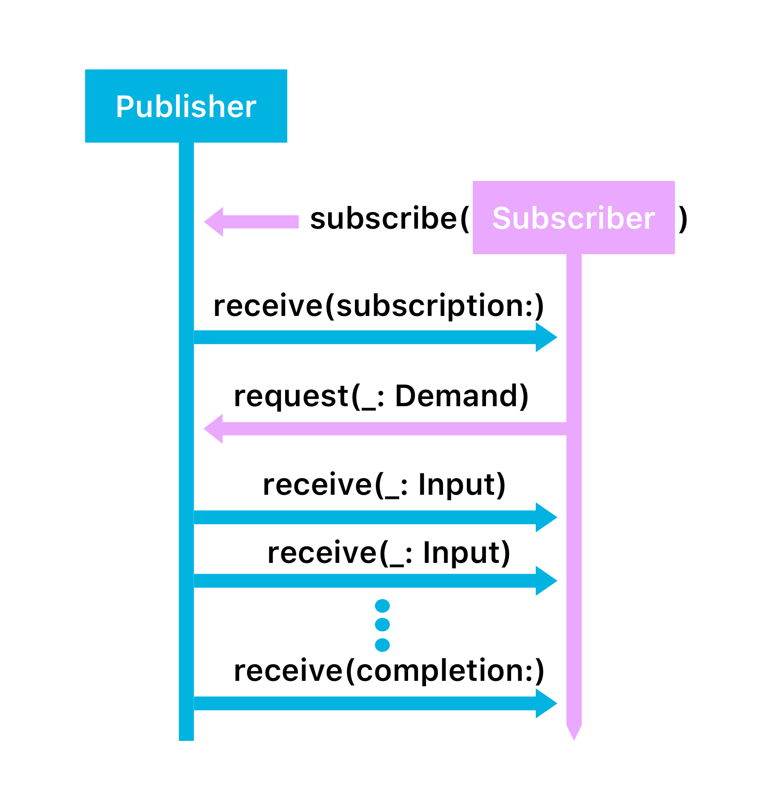

# `Subscriber`

Protocol with associated types `Input` and `Failure` to match publisher's `Output` and `Failure`.

Publisher starts sending values when `subscribe(_:)` called on it, passing in subscriber. Publisher sends subscription to subscriber. Subscriber can then use this subscription to make request from publisher.

After that, publisher is free to send values to subscriber.

