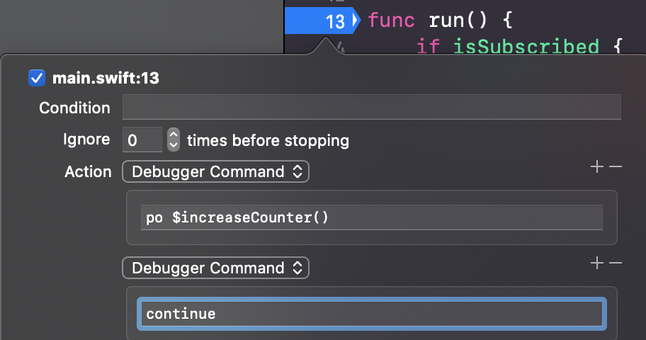

# LLDB

## Command `po` ("print object") and Command `e`

```
po myProperty
0
```

Prints content of property. Actually alias for `expression --object-description --`, argumented version of command `expression` (or just `e`):

```
e myProperty
(Int) $R4 = 0
```

`po` can do everything `e` can. `e` is **evaluating expressions**, which can range from printing properties to changing their values and even defining new classes. Can change property value to force new flow without recompiling:

```
po myProperty = 1
po myProperty
1
```

If `po` entered alone, can write multiline expression, such as creating new methods and classes inside debugging session:

```
po
Enter expressions, then terminate with an empty line to evaluate:
class $BreakpointUtils {
    static var $counter = 0
}
func $increaseCounter() {
    $BreakpointUtils.$counter += 1
    print("Times I've hit this breakpoint: \($BreakpointUtils.$counter)")
}
```

(Dollar signs to indicate that these belong to lldb, not actual code.)

Can now call `$increaseCounter()` directly from lldb:

```
po $increaseCounter()
Times I've hit this breakpoint: 1
po $increaseCounter()
Times I've hit this breakpoint: 2
```

Painful to manually write advanced breakpoint in lldb, but can use Xcode to set up breakpoint that automatically calls funcs.



## Command `v`

`po` evals code by compiling, may not always work.

If doesn't need to be evaluated (like static property), use `v` (**frame variable**) to directly print object content.

## Command `b`

Sets breakpoint.

`b 0x10147d3cf` sets breakpoint at that mem addr.

## Command `continue`

Continue debugging after triggering breakpoint. Same as Xcode button.

## Command `disassemble`

Shows full set of assembly instructions for that stack. Arrow on left shows current instruction.

```
...
    0x109d2b321 <+65>:  callq  *0x120(%rcx)
    0x109d2b327 <+71>:  testb  $0x1, %al
->  0x109d2b329 <+73>:  jne    0x109d2b330               ; <+80> at ViewController.swift
    0x109d2b32b <+75>:  jmp    0x109d2b3cf               ; <+239> at ViewController.swift
    0x109d2b330 <+80>:  movq   0x6db9(%rip), %rax        ; (void *)0x000000010a3f7d00: type metadata for Any
...
```

## Commands `register read` and `register write`

```
register read
General Purpose Registers:
       rax = 0x0000000000000000
       rbx = 0x00007fcebff03b60
       rcx = 0x00007ffee5ed33e0
       rdx = 0x0000000000000020
       rdi = 0x0000000000000064
       rsi = 0x00007ffee5ed33e0
       rbp = 0x00007ffee5ed3480
       rsp = 0x00007ffee5ed3410
        r8 = 0x00007fff89d6ba20  libsystem_pthread.dylib`_pthread_keys
        r9 = 0x0000000000000130
       r10 = 0x00007fff89797888  (void *)0x00007fff897979f0: UITextField
...
```

```
register write rax 0x1
```

`register write` can replace entire object in code. If method will return something undesirable, create new object in lldb, get its memory address with `e` and inject it into desired register.

Combined with `disassemble`, useful if don't have option to recompile code and need to force flow change runtime.

## Commands `memory read` and `memory write`

Similar to the register commands but for mem addr, including instruction memory.

E.g., if forcing to run true-clause of `if` instead of else-clause, look for assembly instruction `jne` (_jump not empty_) and replace its opcode with `je`'s.

Opcodes: <http://faydoc.tripod.com/cpu/je.htm>

## Plugin

LLDB can import plugins. For example, Facebook's [Chisel](https://github.com/facebook/chisel), which has command `border` that adds bright border to `UIView` to easily locate it on screen.
